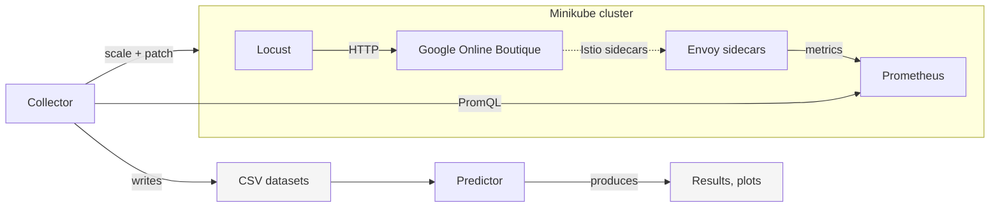

# Kube Performance Predictor

A Master's thesis project for predicting Kubernetes microservice performance using machine learning. It collects Prometheus metrics from a Minikube cluster running Google's microservices-demo with Istio, then trains per-service neural network models on the collected time-series data.

## Headline Results

The thesis answers a single question: how badly does an ML performance model fail when production load enters a regime not seen during training?

| Metric | Interpolation (in-distribution) | Extrapolation (overload, unseen) | Merged (overload seen during training) |
|---|---|---|---|
| Response time MAPE | **6.33%** | **88.29%** | 19.14% |
| Throughput MAPE | 6.16% | 45.04% | 9.65% |
| CPU usage MAPE | 17.52% | 113.28% | 53.01% |

Response time prediction error increases 14x when the system enters saturation regimes not represented in training data — even though the same model architecture recovers most of its accuracy when overload examples are included in training. The failure stems from distribution shift, not from insufficient model capacity.

The same pattern appears in classification (CPU utilization labeled `good` ≤ 40%, `danger` 40–60%, `bottleneck` ≥ 60%):

| Scenario | Mean F1 (weighted) |
|---|---|
| Interpolation | **0.997** |
| Extrapolation | 0.533 |
| Merged | 0.982 |

Under extrapolation, the classifier scores F1 = 0.000 on `frontend` and `checkoutservice` — the two most saturated services in the system. The model labels saturated bottlenecks as healthy.

**Why this matters in practice:** these are exactly the regimes where a model's predictions are most needed (capacity planning, autoscaling decisions during traffic spikes), and exactly the regimes where pure data-driven models are least reliable. The thesis quantifies this gap and motivates hybrid approaches that embed queueing-theoretic constraints into the learning architecture.

## Architecture at a Glance



The collector ramps load against a live Online Boutique deployment and scrapes per-service metrics through Istio sidecars. The predictor trains one multi-task neural network per service, with a shared trunk learning common load-performance representations and three heads specializing in response time, throughput, and CPU usage. Four split strategies (interpolation, extrapolation, merged, stratified) test the model under different distribution-shift conditions.


## Requirements

Ensure that you have the following tools installed:

- [Poetry](https://python-poetry.org/)
- [kubectl](https://kubernetes.io/releases/download/)
- [Minikube](https://minikube.sigs.k8s.io/docs/start/)
- [Istioctl](https://istio.io/latest/docs/setup/getting-started/)
- [Kustomize](https://github.com/kubernetes-sigs/kustomize)

## Installation

Install the Python dependencies using Poetry:

```shell
poetry install
```

## Architecture

### Project Structure

```
kpp/
├── collector/               # Data collection
│   ├── main.py              # Orchestrator: runs load experiments, writes CSV
│   ├── kubernetes_client.py # K8s API wrapper: scaling, service discovery
│   ├── prometheus_client.py # PromQL adapter: response time, throughput, CPU
│   ├── csv_writer.py        # Writes timestamped CSV output
│   └── sample.py            # PerformanceSample frozen dataclass
├── predictor/               # ML training and evaluation
│   ├── main.py              # Orchestrator: training loop, plotting, metrics table
│   ├── pipeline.py          # PerformanceDataPipeline: preprocessing, splitting, classification prep
│   ├── model.py             # PerformanceModel: network definition and training loop
│   └── classification.py    # Classification experiments: classifier training, metrics, plots
├── config.py                # Typed config dataclasses (CollectorConfig, PredictorConfig)
└── logging_config.py        # Logging setup
confs/
├── experiments.yaml         # Collector settings: load profiles and experiment list
└── predictor.yaml           # ML hyperparameters: pipeline, model, training, scheduler, classification
datasets/                    # Pre-collected CSV files (normal and overload profiles)
tests/
```

### Package Descriptions

#### `kpp.collector`

Orchestrates load experiments against a live Kubernetes cluster. `KubernetesClient` handles service discovery (excluding `redis-cart`, which has no Istio metrics), scales service deployments, and ramps load by patching the loadgenerator's `USERS`/`RATE` environment variables. `PrometheusClient` queries Istio metrics via PromQL, returning `math.nan` for missing data. Each experiment runs for a configurable duration with a 60s warmup before sampling; a 180s cooldown separates experiments. Results are written to `dataset/performance_results_YYYYMMDD-HHMMSS.csv` by `CsvWriter`.

#### `kpp.predictor`

Loads CSVs from `datasets/` and runs them through `PerformanceDataPipeline`, which validates the schema, rounds timestamps to 1-minute intervals, aggregates by (timestamp, service), fills gaps, and splits into train/test sets. Four split strategies are supported: `interpolation` (hold out middle user-count values from the normal dataset), `extrapolation` (train on normal load, test on overload), `merged` (train on both datasets combined, holding out middle user-count values), and `stratified` (combine both datasets with a per-class holdout). Each service is normalized independently with a `StandardScaler` plus log transform. A `PerformanceModel` is then trained per service using PyTorch (Adam optimizer with `ReduceLROnPlateau`), with best weights saved to `models/`. After training, `evaluate()` inverts the scaling to produce predictions in original units, and `plot()` generates prediction visualizations in `results/{strategy}/`.

`classification.py` runs a suite of classification experiments that label CPU usage as `good` (≤ 40%), `danger` (40–60%), or `bottleneck` (> 60%). It trains a `ClassificationModel` across three split strategies (extrapolation, stratified, interpolation) and also evaluates a regression-as-classifier approach where the regression model's CPU predictions are thresholded into classes. Results — confusion matrices and per-class metrics tables — are saved to `results/classification/{experiment}/`.

#### `kpp.config`

Dataclasses for both phases: `CollectorConfig` (loaded from `confs/experiments.yaml`) and `PredictorConfig` (loaded from `confs/predictor.yaml`). Both use standard-library YAML parsing with `tomllib`-style field mapping to keep dependencies minimal.

## Configuration

### `confs/experiments.yaml`

Controls the collector:

| Key | Description |
|-----|-------------|
| `experiment_duration_seconds` | How long each experiment runs (default: 600) |
| `profile` | Which load profile to use (`normal` or `overload`) |
| `profiles.<name>` | List of `{users, replicas}` experiments to run |

### `confs/predictor.yaml`

Controls the predictor:

| Section | Key | Description |
|---------|-----|-------------|
| `pipeline` | `train_ratio` | Fraction of data used for training (default: 0.9) |
| `pipeline` | `split_strategy` | `interpolation` or `extrapolation` |
| `model` | `hidden_size` | Size of first shared hidden layer (default: 256) |
| `model` | `hidden_size_2` | Size of second shared hidden layer (default: 256) |
| `model` | `head_hidden_size` | Size of each output head hidden layer (default: 128) |
| `model` | `dropout` | Dropout rate (default: 0.3) |
| `training` | `epochs` | Maximum training epochs (default: 100) |
| `training` | `learning_rate` | Initial Adam learning rate (default: 0.003) |
| `training` | `batch_size` | Mini-batch size (default: 32) |
| `training` | `weight_decay` | Adam weight decay (default: 0.0001) |
| `scheduler` | `factor` | LR reduction factor on plateau (default: 0.5) |
| `scheduler` | `patience` | Epochs to wait before reducing LR (default: 20) |
| `scheduler` | `min_lr` | Minimum learning rate floor (default: 0.000001) |
| `classification` | `good_upper` | CPU% upper threshold for "good" class (default: 40.0) |
| `classification` | `danger_upper` | CPU% upper threshold for "danger" class (default: 60.0) |
| `classification` | `label_smoothing` | Label smoothing for classifier loss (default: 0.1) |

## Setup

### Create the cluster

Initialize a Minikube cluster with sufficient resources:

```shell
minikube start --cpus=6 --memory 8192 --disk-size 32g
```

### Install Istio and Addons

Install the Istio minimal profile and enable sidecar injection for the default namespace:

```shell
istioctl install --set profile=minimal -y
kubectl label namespace default istio-injection=enabled
```

**Important**: The minimal profile does not include Prometheus by default. Install it manually to enable metrics collection:

```shell
kubectl apply -f https://raw.githubusercontent.com/istio/istio/master/samples/addons/prometheus.yaml
```

### Install Gateway API CRDs

Minikube may lack specific Custom Resource Definitions (CRDs) required for the Gateway API. Install them if missing:

```shell
kubectl get crd gateways.gateway.networking.k8s.io &> /dev/null || \
{ kubectl kustomize "github.com/kubernetes-sigs/gateway-api/config/crd?ref=v1.3.0" | kubectl apply -f -; }
```

### Deploy the application

Clone the demo repository and deploy the application with the Istio service mesh component:

```shell
git clone --depth 1 --branch v0 https://github.com/GoogleCloudPlatform/microservices-demo.git
cd microservices-demo/kustomize
kustomize edit add component components/service-mesh-istio
kubectl apply -k .
```

Wait for all pods to be in the `Running` state before proceeding.

## Usage

### Expose Prometheus

Before running the experiment, expose the Prometheus server so the collector can access it:

```shell
kubectl port-forward -n istio-system service/prometheus 9090:9090
```

### Run the collector

In a new terminal, execute the collector script to run load experiments and collect metrics:

```shell
poetry run python kpp/collector/main.py
```

Results are written to `dataset/performance_results_YYYYMMDD-HHMMSS.csv`.

### Train and predict

After collecting data, run the predictor to train per-service models and generate plots:

```shell
poetry run python kpp/predictor/main.py
```

Results (predictions, loss plots, metrics table) are saved to `results/{strategy}/` (e.g. `results/merged/`).

### Run classification experiments

Train classification models and compare against regression-as-classifier baselines:

```shell
poetry run python kpp/predictor/classification.py
```

Results (confusion matrices, per-class metrics tables) are saved to `results/classification/{experiment}/`.

## Development

```shell
# Run linter, type checker, and unit tests in one step
poetry run poe check

# Run e2e smoke test (predictor pipeline, slower)
poetry run poe e2e

# Run individual checks
poetry run ruff check .
poetry run mypy .
poetry run pytest
```
